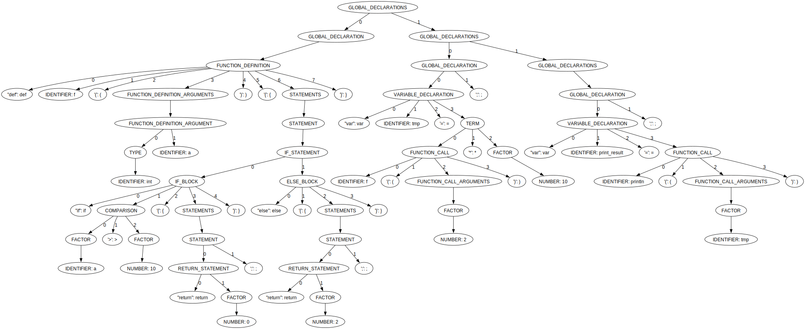

# CCL-project

CCL - библиотека конструирования компилятора. Реализован лексический анализатор для языков программирования, 

Разработан простой язык программирования и интерпретатор к нему, написанный на C++. Особенность проекта в том, 
что реализовано несколько режимом парсинга программы: LL(1), LR(1), GLR, GLL. Конфигурация парсера и лексического 
анализатора задается в специальном файле, что обеспечивает быструю настройку программы. 

В дальнейшем планируется реализации автоматической обработки ошибок: программа в зависимости от контекста будет формировать детальное сообщение пользователю 
о возможных ошибках во всем коде программы.

## Пример сгенерированного дерева разбора одной из программ на разработанном языке

Код программы:
```
def f(int a)
{
    if a > 10 {
        return 0;
    }

    else {
        return 2;
    }
}

var tmp = f(2) * 10;
var print_result = println(tmp);
```

Дерево разбора:



## Поддерживаемые платформы

- Linux x64 и arm64 (включая ALT linux)
- macOS x64 и arm64
- Windows x86, x64 и arm64

## Требования

Для сборки проекта подходят следующие версии компиляторов:

- Clang-17
- GCC-12
- MSVC-19.29

### Зависимости

- [fmt](https://github.com/fmtlib/fmt)
- [cxxopts](https://github.com/jarro2783/cxxopts)

### Опциональные зависимости

- [catch2](https://github.com/catchorg/Catch2)
- [google-benchmark](https://github.com/google/benchmark)

! Все зависимости могут быть установлены при помощи vcpkg

## Сборка проекта

```bash
git clone https://github.com/Vaskozlov/ccl-project.git
cd ccl-project
mkdir build
cd build
```

```bash
cmake .. -G Ninja
ninja
```

## Установка

```bash
ninja install all
```

Также имеется возможность сборки rpm пакет при помощи CPack

```bash
cpack -G RPM
```
