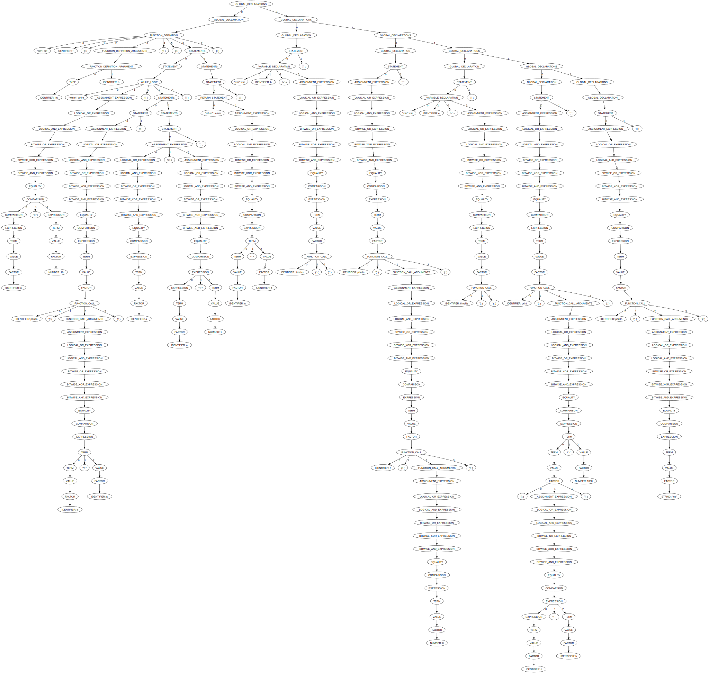

# CCL-project

## Описание

В рамках проекта был разработан простой язык программирования и интерпретатор к нему, написанный на C++.
Особенность проекта в том, что реализовано несколько алгоритмов парсинга программы: LL(1), LR(1), GLR, GLL. 
Конфигурация парсера и лексического анализатора задается в специальном файле, что обеспечивает быструю настройку.

В дальнейшем планируется реализации автоматической обработки ошибок: программа в зависимости от контекста будет формировать детальное сообщение пользователю 
о возможных ошибках во всем коде программы.

## Пример сгенерированного дерева разбора одной из программ на разработанном языке

Код программы:
```
def f(int a)
{
    while a < 10
    {
        println(a * a);
        a = a + 1;
    }

    return a * a;
}

var b = timeNs();
println(f(0));
var e = timeNs();

print((e - b) / 1000);
println("us");
```

Дерево разбора:



## Поддерживаемые платформы

- Linux x64 и arm64 (включая ALT linux)
- macOS x64 и arm64
- Windows x86, x64 и arm64

## Требования

Для сборки проекта подходят следующие версии компиляторов:

- Clang-17
- AppleClang-16
- GCC-13
- MSVC-19.29

### Зависимости

- [fmt](https://github.com/fmtlib/fmt)
- [cxxopts](https://github.com/jarro2783/cxxopts)
- [unordered_dense](https://github.com/martinus/unordered_dense)

### Опциональные зависимости

- [catch2](https://github.com/catchorg/Catch2)
- [google-benchmark](https://github.com/google/benchmark)

! Все зависимости могут быть установлены при помощи vcpkg

## Сборка проекта

```bash
git clone https://github.com/Vaskozlov/ccl-project.git
cd ccl-project
mkdir build
cd build
```

```bash
cmake .. 
cmake --build .
```

## Установка

```bash
cmake --install .
```
